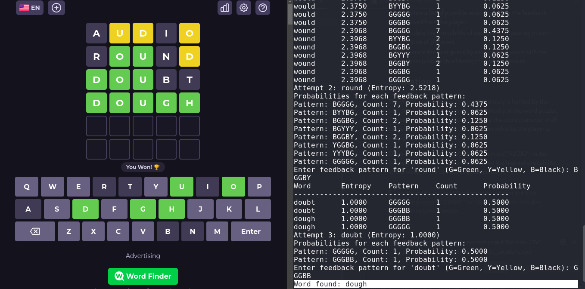

# Wordle Solver Using Information Theory


## Problem Statement

Wordle is a word puzzle game where the player has to guess a five-letter word within six attempts. After each guess, the player is given feedback in the form of colored tiles. A green tile indicates that the letter is present in the word and is in the correct position, a yellow tile indicates that the letter is present in the word but is in the wrong position, and a gray tile indicates that the letter is not present in the word.

The goal of this project is to develop a Wordle solver using information theory. The solver should take the feedback from the player and generate the next guess based on the information provided.

This project inspired by 3Blue1Brown's video on [Solve Wordle using Information Theory](https://www.youtube.com/watch?v=v68zYyaEmEA).

Youtube:
[](https://www.youtube.com/watch?v=v68zYyaEmEA)

## Approach


The Wordle solver will use a probabilistic approach to generate the next guess. It will maintain a list of possible words based on the feedback received from the player and calculate the probability of each letter appearing in each position of the word. The solver will then generate the next guess by selecting the word with the highest probability of being the correct answer.

## Implementation

The Wordle solver will be implemented in Python using the following steps:

1. Load a list of five-letter words from a dictionary file.
2. Initialize a list of possible words based on the feedback received from the player.
3. Calculate the probability of each letter appearing in each position of the word.
4. Generate the next guess by selecting the word with the highest probability of being the correct answer.



In this case, the color of the tiles is represented by the following values:
- Green: G
- Yellow: Y
- Gray: B (Black)

## Limitation

The Wordle solver using information theory is limited by the size of the dictionary file and the complexity of the word puzzle. The solver may not be able to generate the correct answer in all cases, especially when the feedback provided by the player is ambiguous or inconsistent.

Opening word is currently static using word "AUDIO", in the future, I want make it dynamic based on the highest probability of the word, or we can use suggestion from: 

> mathematician Grant Sanderson found that the best starting word is “CRANE" or “SLOTH”, which includes frequently used letters.

## Usage

To use the Wordle solver, follow these steps:

1. Clone the repository:

```bash
git clone https://github.com/KrisnaSantosa15/wordle_solver_using_information_theory.git
```

2. Install the required dependencies:

```bash
pip install -r requirements.txt
```

3. Run the Wordle solver:

```bash
python wordle_solver.py
```

4. Enter the feedback provided by the player in the format `GGYGB` (Green, Green, Yellow, Green, Black).

5. The solver will generate the next guess based on the feedback provided.

## Conclusion

The Wordle solver using information theory provides an efficient and effective way to solve Wordle puzzles. By using a probabilistic approach, the solver can generate the next guess based on the information provided by the player. This project demonstrates the application of information theory in solving word puzzles and highlights the importance of probability in decision-making processes.

## References

1. [Wordle](https://wordly.org/)
2. [Information Theory](https://en.wikipedia.org/wiki/Information_theory)
3. [Probabilistic Methods](https://en.wikipedia.org/wiki/Probabilistic_method)
4. [Python Programming Language](https://www.python.org/)
5. [Dictionary File](https://www.kaggle.com/datasets/bcruise/wordle-valid-words)
